# AgentLens Architecture

AgentLens is a VS Code extension that receives OpenTelemetry (OTLP) telemetry from AI coding agents (GitHub Copilot, Claude Code, Codex), persists it to a local SQLite database, summarises it into per-session cards, and visualises it in a sidebar and a full dashboard.

---

## Table of Contents

1. [System Overview](#1-system-overview)
2. [Extension Activation](#2-extension-activation)
3. [Data Ingestion Pipeline](#3-data-ingestion-pipeline)
4. [OTLP Collector](#4-otlp-collector)
5. [Session Summarizer](#5-session-summarizer)
6. [Per-Agent Summarizers](#6-per-agent-summarizers)
7. [SQLite Storage Layer](#7-sqlite-storage-layer)
8. [Session Data Model](#8-session-data-model)
9. [Frontend Architecture](#9-frontend-architecture)
10. [Cost Calculation](#10-cost-calculation)
11. [Auto-Configuration](#11-auto-configuration)
12. [Build Pipeline](#12-build-pipeline)

---

## 1. System Overview

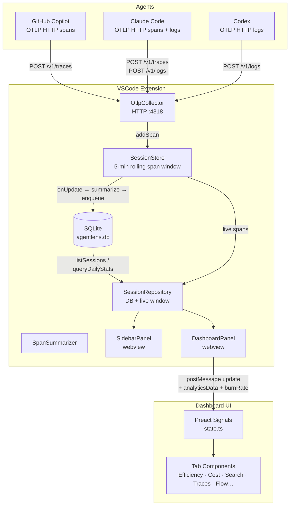

---

## 2. Extension Activation

The extension activates in a fixed sequence.

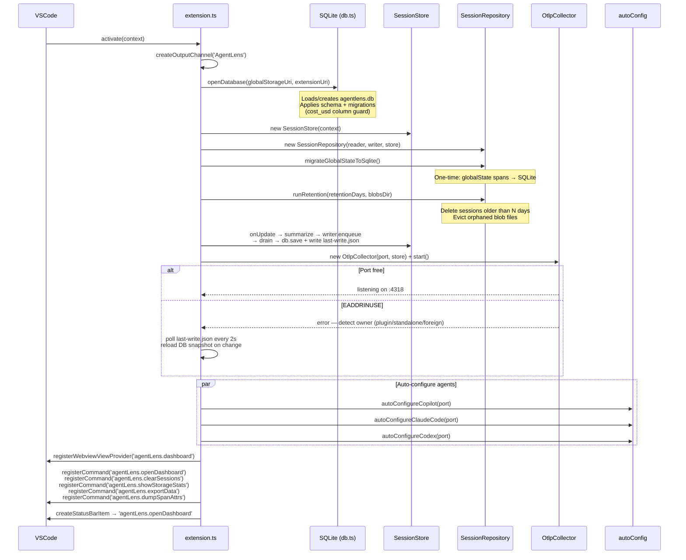

---

## 3. Data Ingestion Pipeline

Spans travel from agent process → HTTP → collector → store → summarizer → SQLite → UI.

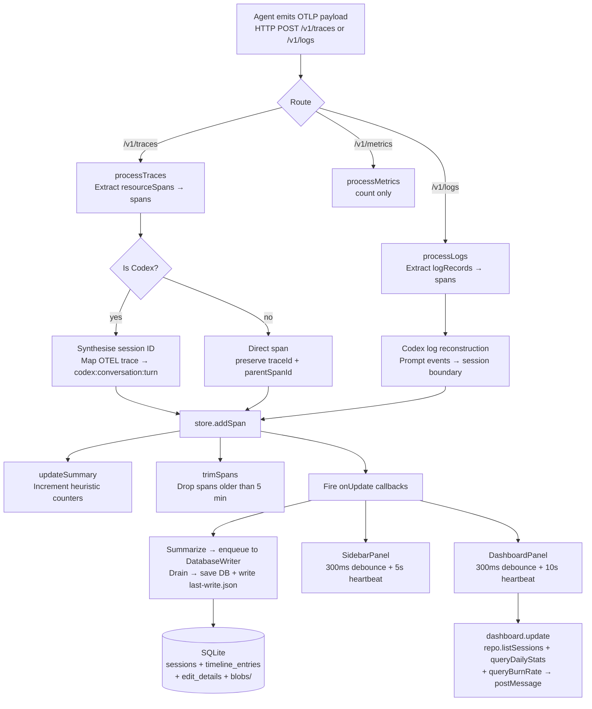

---

## 4. OTLP Collector

A minimal HTTP/1.1 server (Node `http` module) that handles three routes and maintains stateful session reconstruction for Codex.

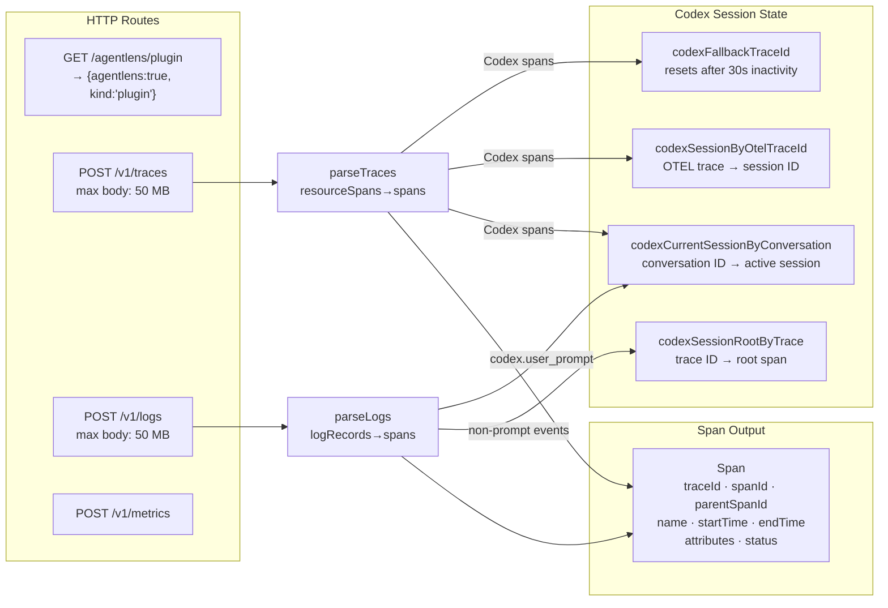

**Key non-obvious behaviour:** Codex session IDs (`codex:{conversationId}:{turnId}`) are assigned on arrival. Once set, the mapping is immutable even if spans arrive out of order or are retried.

---

## 5. Session Summarizer

`summarizeSpans()` is called on the live rolling span window (last 5 minutes). It groups raw spans into agent-session cards and computes cross-session efficiency metrics. Historical sessions are read directly from SQLite; the two sources are merged by `SessionRepository`.

```mermaid
flowchart TD
    IN[spans: Span\[\]] --> GRP[Group spans by traceId<br/>Build parentSpanId → children map]

    GRP --> CP_FIND[Find invoke_agent spans<br/>Copilot roots]
    GRP --> CC_FIND[Find claude_code.interaction spans<br/>Claude roots]
    GRP --> CX_FIND[Group by codex session ID<br/>Codex roots]

    CP_FIND --> CP_SYN{Missing parents?}
    CP_SYN -- yes --> CP_SYNTH[Synthesise invoke_agent root<br/>for orphan spans]
    CP_SYN -- no --> CP_B
    CP_SYNTH --> CP_B[buildCopilotSessions]

    CC_FIND --> CC_SYN{Missing interaction?}
    CC_SYN -- yes --> CC_SYNTH[Synthesise claude_code.interaction]
    CC_SYN -- no --> CC_B
    CC_SYNTH --> CC_B[buildClaudeSessions]

    CX_FIND --> CX_B[buildCodexSessions]

    CP_B --> SESSIONS[SessionSummaryCard\[\]]
    CC_B --> SESSIONS
    CX_B --> SESSIONS

    SESSIONS --> LOOP[detectLoopSignals<br/>per session]
    SESSIONS --> BG[Background spans<br/>orphans not in any session]
    SESSIONS --> EFF[EfficiencyReport<br/>token totals · TTFT · cache hit rate]

    LOOP --> OUT[FullSummary]
    BG --> OUT
    EFF --> OUT
```

---

## 6. Per-Agent Summarizers

Each agent uses a different span structure. The summarizers normalise these into a common `SessionSummaryCard`.

```mermaid
graph TB
    subgraph Copilot — buildCopilotSessions
        CP_ROOT[invoke_agent span<br/>root of session]
        CP_LLM[chat gpt-4.1 span<br/>type: llm<br/>tokens · model · TTFT<br/>output messages JSON]
        CP_TOOL[execute_tool span<br/>type: tool<br/>gen_ai.tool.name<br/>gen_ai.tool.call.arguments]
        CP_ROOT --> CP_LLM
        CP_ROOT --> CP_TOOL
    end

    subgraph Claude — buildClaudeSessions
        CC_ROOT[claude_code.interaction<br/>root — may be synthetic]
        CC_LLM[claude_code.llm_request<br/>type: llm<br/>input/output/cache tokens<br/>ttft_ms · stop_reason]
        CC_TOOL[claude_code.tool<br/>type: tool<br/>tool_name · file_path]
        CC_ROOT --> CC_LLM
        CC_ROOT --> CC_TOOL
    end

    subgraph Codex — buildCodexSessions
        CX_PROMPT[codex.user_prompt<br/>session boundary]
        CX_LLM[codex.sse_event / codex.completion<br/>type: llm · token counts]
        CX_TOOL[exec_command / apply_patch<br/>type: tool]
        CX_PROMPT --> CX_LLM
        CX_PROMPT --> CX_TOOL
    end

    CP_ROOT & CC_ROOT & CX_PROMPT --> CARD[SessionSummaryCard<br/>source · model · turns<br/>tokens · cacheHitRate<br/>timeline: TimelineEntry\[\]<br/>filesRead/Changed/Searched<br/>toolCounts · errors · outcome]
```

---

## 7. SQLite Storage Layer

Introduced in phases 1–4. The database is the authoritative source for all historical session data. The live 5-minute span window supplements it for in-progress sessions.

### Schema

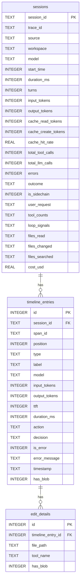

Large string fields (`responseText`, `thinking`, `toolInput`, `fullResult`, `oldString`, `newString`) above 512 bytes are stored as files at `globalStorageUri/blobs/<spanId>-<field>.txt` rather than inline in the DB. The `has_blob` flag indicates when to read from disk instead.

### Component responsibilities

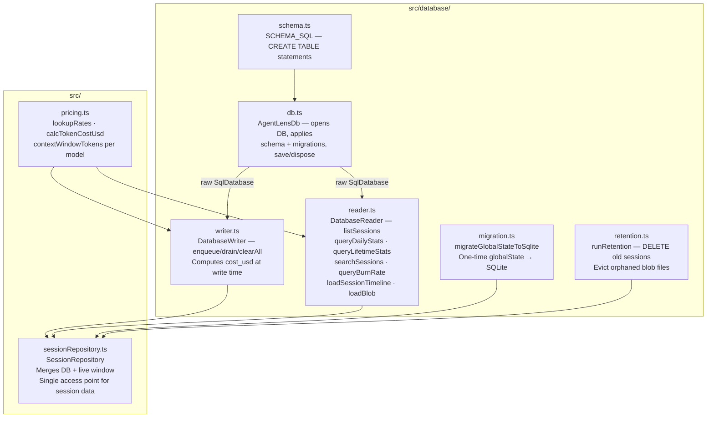

### Data flow: write path

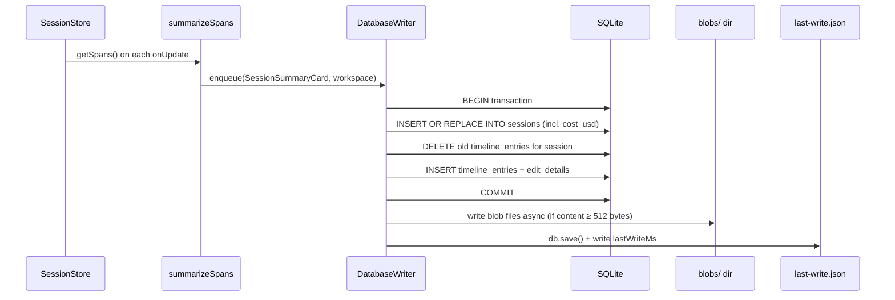

### Data flow: read path

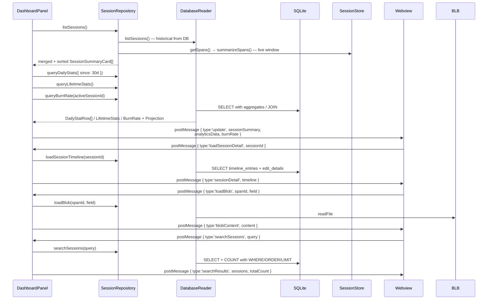

### Cross-window sync

When two VS Code windows are open and one holds the OTLP collector (port 4318), the other cannot collect spans. The non-collector window polls `last-write.json` every 2 seconds and reloads a fresh DB snapshot via `openReadonlySnapshot()` when the timestamp advances.

### Storage management

`agentLens.sessionRetentionDays` (default 90) controls how long sessions are kept. `runRetention` is called at activation and every 24 hours. After deleting old rows it scans `blobs/` and removes any file whose span ID is no longer in `timeline_entries`.

`agentLens.showStorageStats` reports DB file size, blob directory size, session count, and date range to the Output channel.

---

## 8. Session Data Model

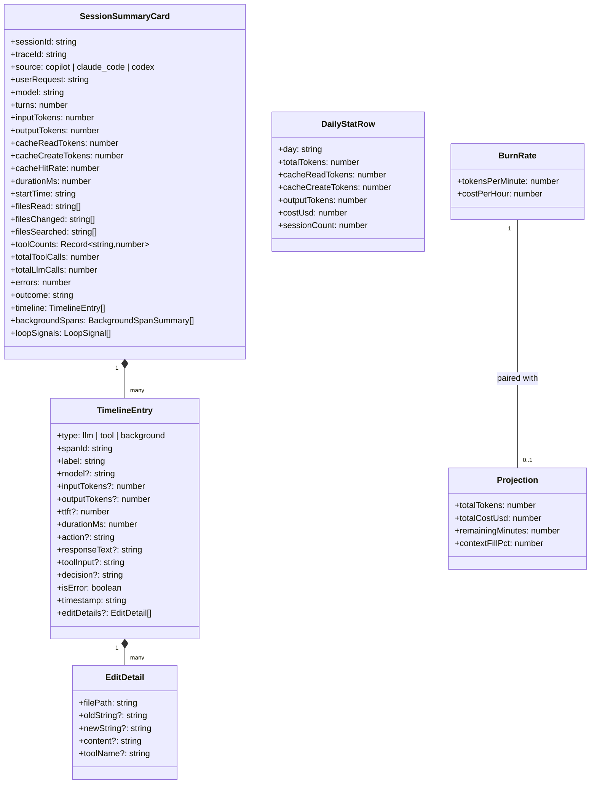

**Lazy timeline loading:** `SessionSummaryCard.timeline` is always `[]` when read from SQLite. The webview requests individual timelines on demand via `loadSessionDetail`. Blob fields (`responseText`, `thinking`, etc.) are further deferred until the user expands an entry (`loadBlob`).

---

## 9. Frontend Architecture

The dashboard is a Preact application bundled into `media/dashboard.js`. It uses `@preact/signals` for reactive state — no Redux, no Context, no prop drilling.

### Signal graph

```mermaid
graph TD
    subgraph Core data — set by DashboardPanel messages
        SIG_SUM[sessionSummary<br/>Signal&lt;FullSummary | null&gt;]
        SIG_TOOLS[toolCalls<br/>Signal&lt;Record&gt;]
        SIG_TL[sessionTimelines<br/>Signal&lt;Record&lt;sessionId, TimelineEntry[]&gt;&gt;]
        SIG_BLOB[blobCache<br/>Signal&lt;Record&lt;spanId:field, string&gt;&gt;]
        SIG_DS[dailyStats<br/>Signal&lt;DailyStatRow[]&gt;]
        SIG_LS[lifetimeStats<br/>Signal&lt;LifetimeStats | null&gt;]
        SIG_BR[burnRateData<br/>Signal&lt;BurnRateData | null&gt;]
        SIG_SR[searchResults<br/>Signal&lt;SearchResultData | null&gt;]
    end

    subgraph UI controls
        SIG_LIM[sessionLimit<br/>Signal&lt;number&gt; = 10]
        SIG_AGT[selectedAgentFilter<br/>Signal&lt;AgentFilter&gt; = all]
        SIG_TAB[activeTab<br/>Signal&lt;string&gt; = efficiency]
    end

    subgraph Computed
        COMP_FILT[agentFilteredSessions<br/>computed — filter by source]
        COMP_DISP[displaySessions<br/>computed — last N sessions]
        COMP_PRES[agentPresence<br/>computed — which agents active]
    end

    SIG_SUM --> COMP_FILT
    SIG_AGT --> COMP_FILT
    COMP_FILT --> COMP_DISP
    SIG_LIM --> COMP_DISP
    COMP_DISP --> COMP_PRES

    COMP_DISP --> TAB_COMPS[Tab components]
    SIG_TL --> TAB_COMPS
    SIG_BLOB --> TAB_COMPS
    SIG_DS --> TAB_COMPS
    SIG_LS --> TAB_COMPS
    SIG_BR --> TAB_COMPS
    SIG_SR --> TAB_COMPS
    SIG_TAB --> TAB_COMPS
```

### Tab component overview

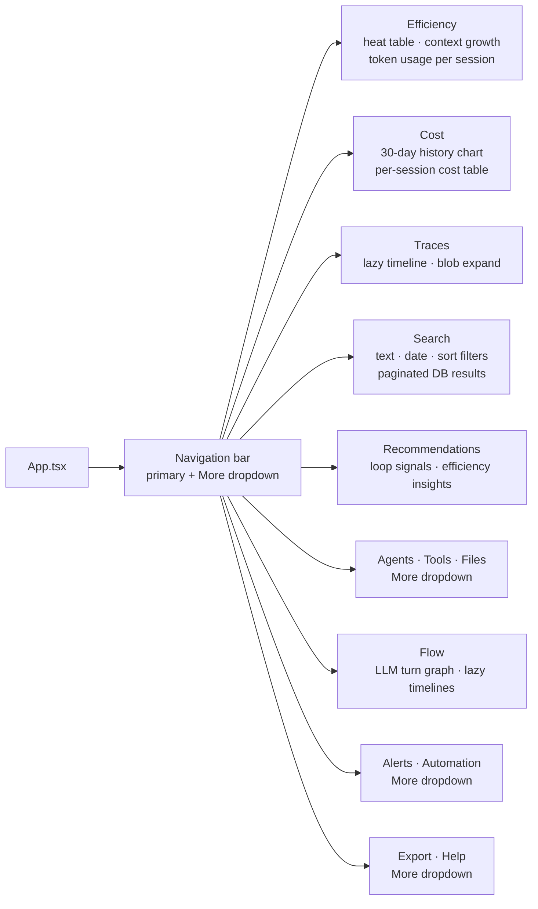

### DashboardPanel ↔ Webview message protocol

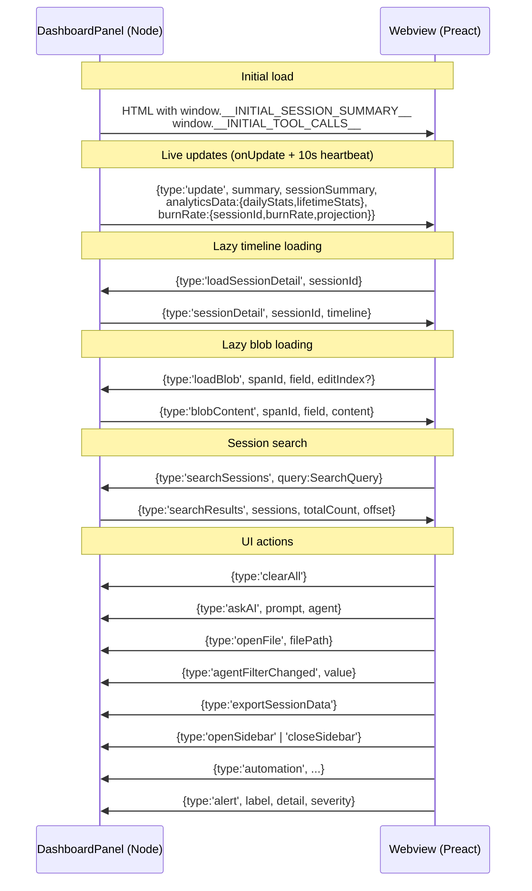

---

## 10. Cost Calculation

Cost is computed in two places:

1. **Extension host** (`src/pricing.ts`) — at write time; `cost_usd` is stored in the `sessions` row and used for all aggregate queries (`SUM(cost_usd)`, `queryDailyStats`, `queryBurnRate`).
2. **Browser** (`media/src/pricing.ts`) — at display time; per-turn cost shown in the Cost tab and Flow tooltip. The two rate tables are kept in sync manually.

```mermaid
flowchart TD
    subgraph Extension host — write time
        CARD[SessionSummaryCard] --> PRI_EXT[src/pricing.ts<br/>calcTokenCostUsd]
        PRI_EXT --> DB_COST[sessions.cost_usd<br/>stored in SQLite]
    end

    subgraph Browser — display time
        ENTRY[TimelineEntry<br/>model · tokens] --> LR[lookupRates<br/>normalise + prefix match]
        LR --> RATES{Rates found?}
        RATES -- no  --> ZERO[cost=0, modelUnknown=true]
        RATES -- yes --> MODE{PricingMode}
        MODE -- token --> TC[calcTokenCost<br/>input/cacheRead/cacheWrite/output<br/>× per-MTok rate ÷ 1,000,000]
        MODE -- request --> RC[calcRequestCost<br/>turns × multiplier × $0.04]
        MODE -- request-annual --> RA[calcRequestCost<br/>turns × multiplierAnnualPostJun1 × $0.04]
        TC --> ENTRY_COST[calcEntryCost → Flow tooltip]
        TC --> SESS_COST[calcSessionCost → Cost tab table]
        RC --> SESS_COST
        RA --> SESS_COST
    end

    subgraph Analytics — query time
        DB_COST --> AGG[queryDailyStats<br/>SUM cost_usd GROUP BY day]
        DB_COST --> LIFE[queryLifetimeStats<br/>SUM cost_usd]
        DB_COST --> BURN[queryBurnRate<br/>tokensPerMinute × costPerToken × 60]
    end
```

`contextWindowTokens` (stored in `src/pricing.ts`) enables the `Projection` calculation: given current session token usage and burn rate, estimate time to context exhaustion and final cost.

Pricing data covers: OpenAI (GPT-4.1 through GPT-5.5), Anthropic (Claude Haiku/Sonnet/Opus 4.x), Google (Gemini 2.5–3.5), Codex, and fine-tuned models. Last updated: 2026-05-28.

---

## 11. Auto-Configuration

When the extension activates it attempts to configure each agent automatically.

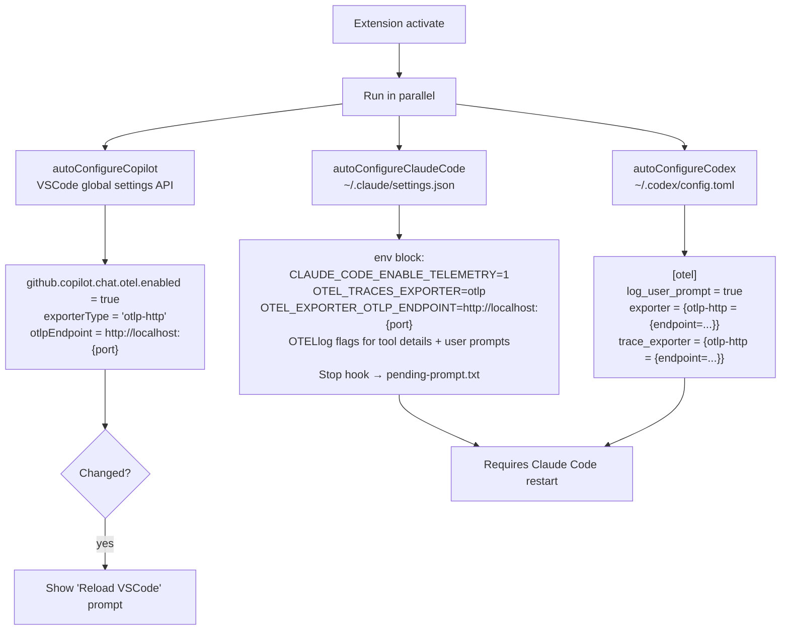

---

## 12. Build Pipeline

Four independent esbuild targets produce four output bundles.

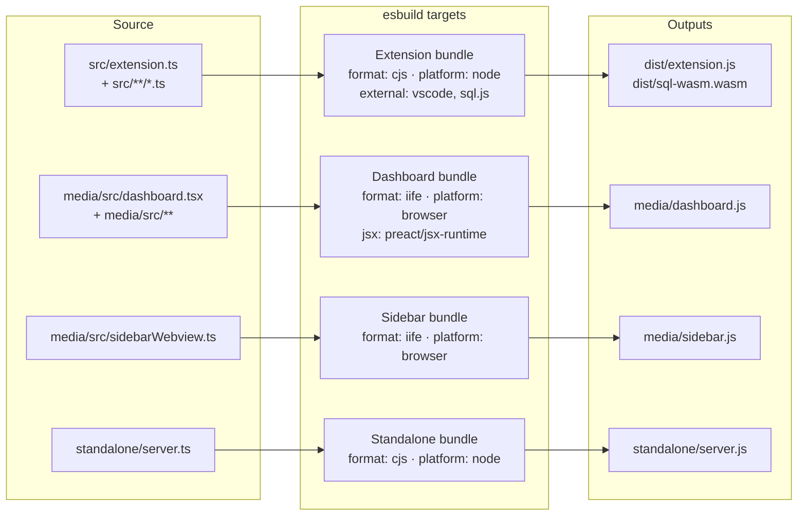

`sql.js` is loaded dynamically at runtime (not bundled) to keep the extension bundle small. The WASM binary is copied to `dist/sql-wasm.wasm` during the build and located via `extensionUri` at activation.

### Type-check vs bundle

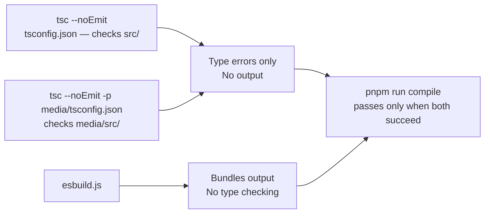

---

## File Map

```text
agentlens/
├── src/
│   ├── extension.ts              # Activation, commands, panels, status bar, retention
│   ├── otlpCollector.ts          # HTTP server, Codex session synthesis
│   ├── otlpParser.ts             # Pure parsing (tests/standalone)
│   ├── sessionStore.ts           # 5-min rolling span window, onUpdate callbacks
│   ├── sessionRepository.ts      # Merges DB + live window; single session data access point
│   ├── spanSummarizer.ts         # Orchestrates per-agent builders
│   ├── pricing.ts                # Extension-host pricing: lookupRates, calcTokenCostUsd
│   ├── sidebarPanel.ts           # Sidebar webview
│   ├── dashboardPanel.ts         # Full dashboard webview, message protocol
│   ├── autoConfig.ts             # Copilot VS Code settings
│   ├── autoConfigNode.ts         # Claude/Codex file-based config
│   ├── exportData.ts             # JSON export helpers
│   ├── loopDetector.ts           # Loop signal detection
│   ├── types.ts                  # Shared extension-host types
│   ├── database/
│   │   ├── schema.ts             # SCHEMA_SQL — CREATE TABLE statements + indexes
│   │   ├── db.ts                 # AgentLensDb — open, migrate, save, dispose
│   │   ├── writer.ts             # DatabaseWriter — enqueue/drain, blob writes, cost_usd
│   │   ├── reader.ts             # DatabaseReader — list, search, analytics, burn rate, blobs
│   │   ├── migration.ts          # migrateGlobalStateToSqlite (one-time)
│   │   ├── retention.ts          # runRetention — DELETE old sessions + blob eviction
│   │   └── types.ts              # Shared DB types
│   ├── summarizers/
│   │   ├── claude.ts             # Claude Code session builder
│   │   ├── copilot.ts            # Copilot session builder
│   │   ├── codex.ts              # Codex session builder
│   │   ├── helpers.ts            # Shared attribute/token extraction
│   │   └── summarizerTypes.ts    # SessionSummaryCard, TimelineEntry, etc.
│   └── test/
│       ├── sessionStore.test.ts
│       ├── database/
│       │   ├── writer.test.ts
│       │   ├── reader.test.ts
│       │   ├── reader.analytics.test.ts
│       │   ├── migration.test.ts
│       │   ├── retention.test.ts
│       │   └── sessionRepository.test.ts
│       └── pricing.test.ts
├── media/
│   ├── src/
│   │   ├── App.tsx               # Preact root, message handler, tab router
│   │   ├── state.ts              # All signals: sessions, timelines, blobs, analytics, search
│   │   ├── types.ts              # Frontend types mirroring backend + analytics types
│   │   ├── pricing.ts            # Browser pricing: rate table, lookupRates, calcTokenCost
│   │   ├── sessionMetrics.ts     # calcSessionCost, calcEntryCost, fmtUsd
│   │   ├── utils.ts              # Formatting, span helpers, agent colors
│   │   ├── agentProfiles.ts      # Per-agent alert thresholds
│   │   ├── sidebarWebview.ts     # Sidebar JS (no JSX)
│   │   └── tabs/
│   │       ├── Efficiency.tsx    # Heat table, context growth chart, token usage chart
│   │       ├── Cost.tsx          # 30-day history chart, per-session cost table
│   │       ├── Traces.tsx        # Lazy timeline, blob expand
│   │       ├── SessionSearch.tsx # Text/date/sort search, paginated DB results
│   │       ├── Flow.tsx          # LLM turn graph (canvas), lazy timeline loading
│   │       ├── Recommendations.tsx
│   │       ├── Agents.tsx
│   │       ├── Tools.tsx
│   │       ├── Files.tsx
│   │       ├── Alerts.tsx
│   │       ├── Automation.tsx
│   │       ├── Export.tsx
│   │       ├── Help.tsx
│   │       └── Timeline.tsx      # Shared timeline rendering component
│   ├── dashboard.js              # Compiled Preact bundle
│   ├── dashboard.css             # Compiled styles
│   └── sidebar.js                # Compiled sidebar script
├── standalone/
│   └── server.ts                 # Standalone HTTP server (no VS Code)
├── esbuild.js                    # Build configuration (4 targets)
├── package.json                  # VS Code manifest + scripts
└── ARCHITECTURE.md               # This file
```
