# AgentLens Architecture

AgentLens is a VSCode extension that receives OpenTelemetry (OTLP) telemetry from AI coding agents (GitHub Copilot, Claude Code, Codex), summarizes it into per-session cards, and visualises it in a sidebar and a full dashboard.

---

## Table of Contents

1. [System Overview](#1-system-overview)
2. [Extension Activation](#2-extension-activation)
3. [Data Ingestion Pipeline](#3-data-ingestion-pipeline)
4. [OTLP Collector](#4-otlp-collector)
5. [Session Summarizer](#5-session-summarizer)
6. [Per-Agent Summarizers](#6-per-agent-summarizers)
7. [Session Data Model](#7-session-data-model)
8. [Frontend Architecture](#8-frontend-architecture)
9. [Cost Calculation](#9-cost-calculation)
10. [Auto-Configuration](#10-auto-configuration)
11. [Build Pipeline](#11-build-pipeline)

---

## 1. System Overview

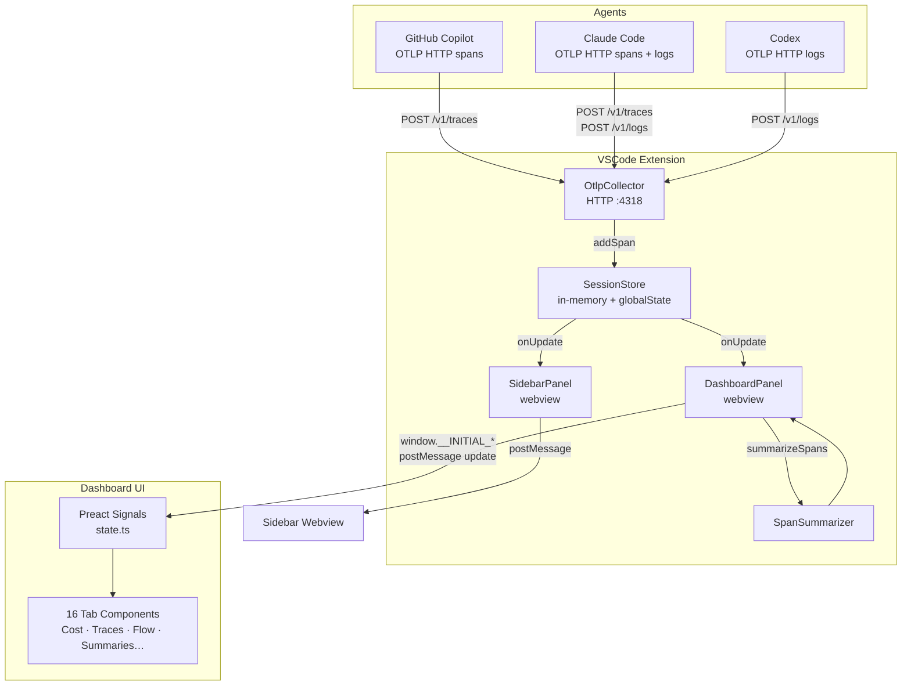

---

## 2. Extension Activation

The extension activates in a fixed sequence. Each step is a prerequisite for the next.

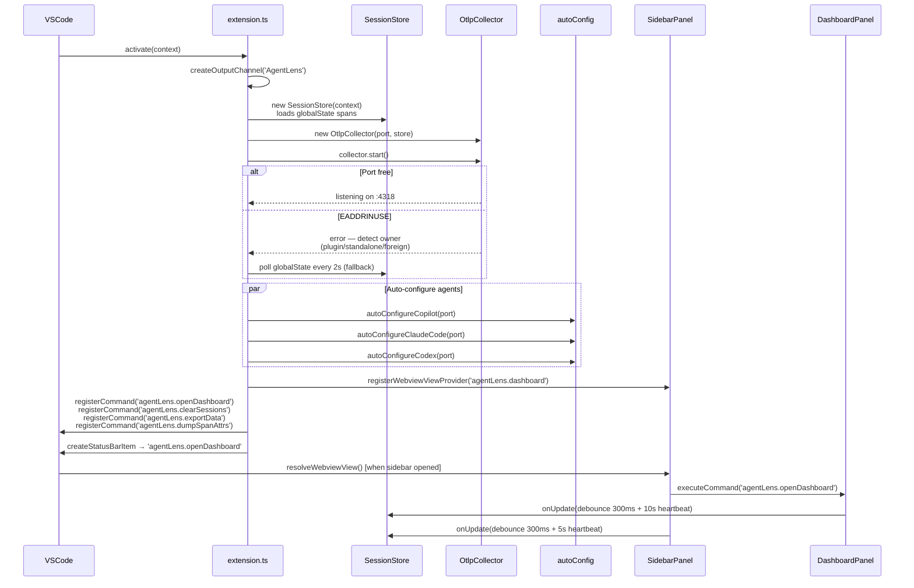

---

## 3. Data Ingestion Pipeline

Spans travel from agent process → HTTP → collector → store → summarizer → UI.

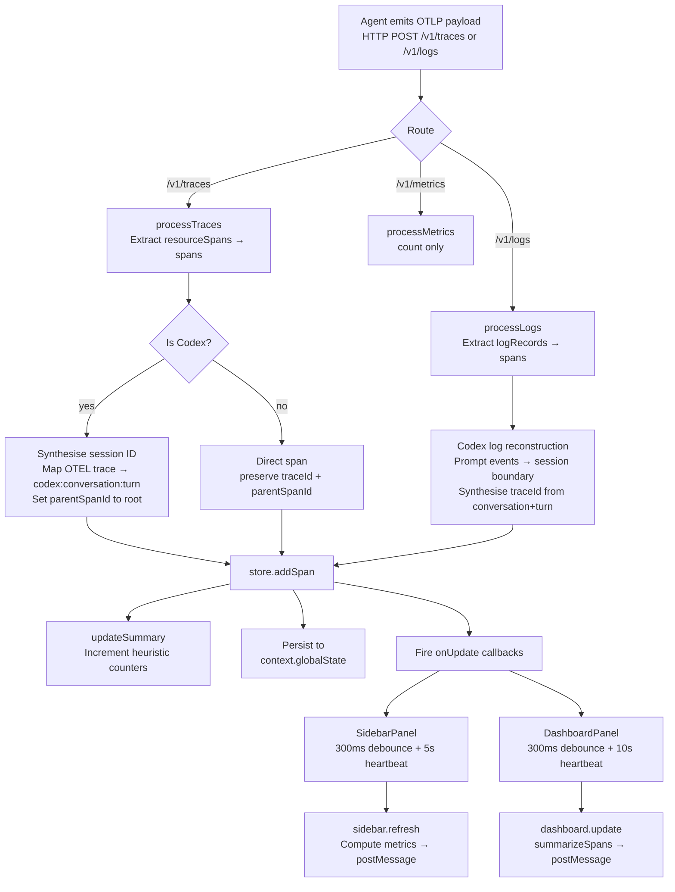

---

## 4. OTLP Collector

The collector is a minimal HTTP/1.1 server (Node `http` module) that handles three routes and maintains stateful session reconstruction for Codex.

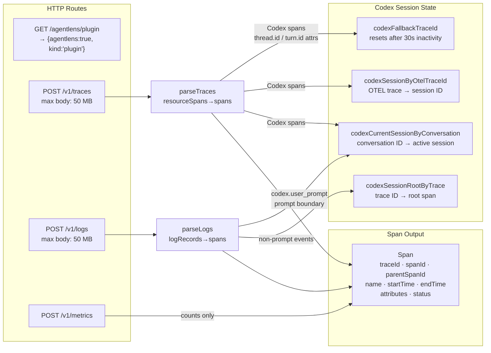

**Key non-obvious behaviour:** Codex session IDs (`codex:{conversationId}:{turnId}`) are assigned on arrival. If spans arrive out of order or are retried, the session mapping is immutable once set.

---

## 5. Session Summarizer

`summarizeSpans()` is called on every dashboard update. It groups raw spans into agent-session cards and computes cross-session efficiency metrics.

```mermaid
flowchart TD
    IN[spans: Span\[\]] --> GRP[Group spans by traceId\nBuild parentSpanId → children map]

    GRP --> CP_FIND[Find invoke_agent spans\nCopilot roots]
    GRP --> CC_FIND[Find claude_code.interaction spans\nClaude roots]
    GRP --> CX_FIND[Group by codex session ID\nCodex roots]

    CP_FIND --> CP_SYN{Missing parents?}
    CP_SYN -- yes --> CP_SYNTH[Synthesise invoke_agent root\nfor orphan chat/execute_tool spans]
    CP_SYN -- no --> CP_B
    CP_SYNTH --> CP_B[buildCopilotSessions]

    CC_FIND --> CC_SYN{Missing interaction?}
    CC_SYN -- yes --> CC_SYNTH[Synthesise claude_code.interaction\nfor orphan llm_request/tool spans]
    CC_SYN -- no --> CC_B
    CC_SYNTH --> CC_B[buildClaudeSessions]

    CX_FIND --> CX_B[buildCodexSessions]

    CP_B --> SESSIONS[SessionSummaryCard\[\]]
    CC_B --> SESSIONS
    CX_B --> SESSIONS

    SESSIONS --> LOOP[detectLoopSignals\nper session]
    SESSIONS --> BG[Background spans\norphans not in any session]
    SESSIONS --> EFF[EfficiencyReport\ntoken totals · TTFT · cache hit rate\ntool def waste · top consumers]

    LOOP --> OUT[FullSummary]
    BG --> OUT
    EFF --> OUT
```

---

## 6. Per-Agent Summarizers

Each agent uses a different span structure. The summarizers normalise these into a common `SessionSummaryCard`.

```mermaid
graph TB
    subgraph Copilot — buildCopilotSessions
        CP_ROOT[invoke_agent span\nroot of session]
        CP_LLM[chat gpt-4.1 span\ntype: llm\ntokens · model · TTFT\noutput messages JSON]
        CP_TOOL[execute_tool span\ntype: tool\ngen_ai.tool.name\ngen_ai.tool.call.arguments\ngen_ai.tool.call.result]
        CP_ROOT --> CP_LLM
        CP_ROOT --> CP_TOOL
    end

    subgraph Claude — buildClaudeSessions
        CC_ROOT[claude_code.interaction\nroot — may be synthetic]
        CC_LLM[claude_code.llm_request\ntype: llm\ninput/output/cache tokens\nttft_ms · stop_reason\ngen_ai.output.messages → edit details]
        CC_TOOL[claude_code.tool\ntype: tool\ntool_name · file_path\nfull_command / tool_input]
        CC_BLK[claude_code.tool.blocked_on_user\nchild of tool\ndecision · source]
        CC_ROOT --> CC_LLM
        CC_ROOT --> CC_TOOL
        CC_TOOL --> CC_BLK
    end

    subgraph Codex — buildCodexSessions
        CX_PROMPT[codex.user_prompt\nsession boundary]
        CX_LLM[codex.sse_event / codex.completion\ntype: llm\ntoken counts]
        CX_TTFT[codex.turn_ttft\nttft → next LLM entry]
        CX_TOOL[exec_command / apply_patch\ntype: tool\nresolved from codex.tool_decision]
        CX_PROMPT --> CX_LLM
        CX_LLM --- CX_TTFT
        CX_PROMPT --> CX_TOOL
    end

    CP_ROOT & CC_ROOT & CX_PROMPT --> CARD[SessionSummaryCard\nsource · model · turns\ntokens · cacheHitRate\ntimeline: TimelineEntry\[\]\nfilesRead/Changed/Searched\ntoolCounts · errors · outcome]
```

---

## 7. Session Data Model

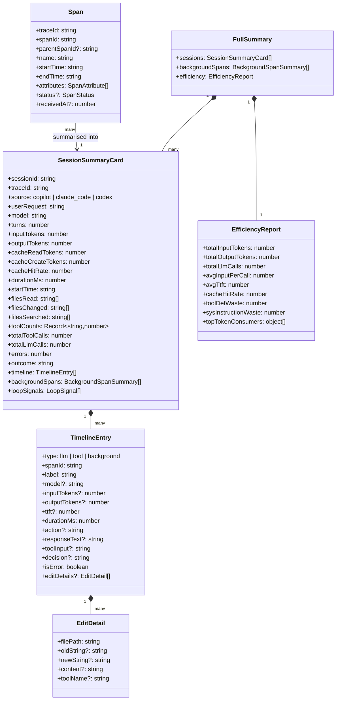

---

## 8. Frontend Architecture

The dashboard is a Preact application bundled into `media/dashboard.js`. It uses `@preact/signals` for reactive state — no Redux, no Context, no prop drilling.

### Signal graph

```mermaid
graph TD
    subgraph Core data — set by DashboardPanel
        SIG_SPANS[spans\nSignal&lt;Span[]&gt;]
        SIG_SUM[sessionSummary\nSignal&lt;FullSummary | null&gt;]
        SIG_TOOLS[toolCalls\nSignal&lt;Record&gt;]
    end

    subgraph UI controls
        SIG_LIM[sessionLimit\nSignal&lt;number&gt; = 10]
        SIG_AGT[selectedAgentFilter\nSignal&lt;AgentFilter&gt; = all]
        SIG_TAB[activeTab\nSignal&lt;string&gt; = efficiency]
    end

    subgraph Computed — auto-update when inputs change
        COMP_FILT[agentFilteredSessions\ncomputed — filter by source]
        COMP_DISP[displaySessions\ncomputed — last N sessions]
        COMP_SPANS[displaySpans\ncomputed — spans for displayed sessions]
        COMP_PRES[agentPresence\ncomputed — which agents are active]
    end

    SIG_SUM --> COMP_FILT
    SIG_AGT --> COMP_FILT
    COMP_FILT --> COMP_DISP
    SIG_LIM --> COMP_DISP
    COMP_DISP --> COMP_SPANS
    SIG_SPANS --> COMP_SPANS
    COMP_DISP --> COMP_PRES

    COMP_DISP --> TAB_COMPS[Tab components\nCost · Tokens · Efficiency\nSummaries · Flow · Traces\nErrors · Alerts · …]
    COMP_SPANS --> TAB_COMPS
    SIG_TAB --> TAB_COMPS
```

### Tab component overview

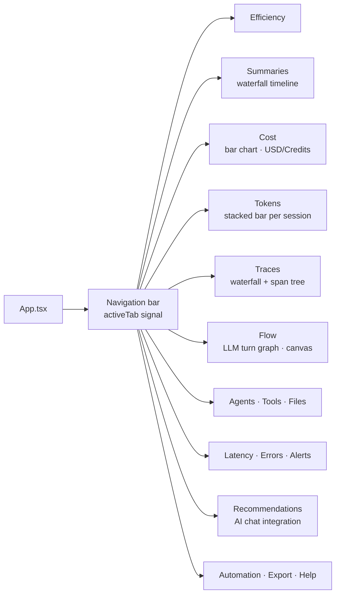

### DashboardPanel ↔ Webview message protocol

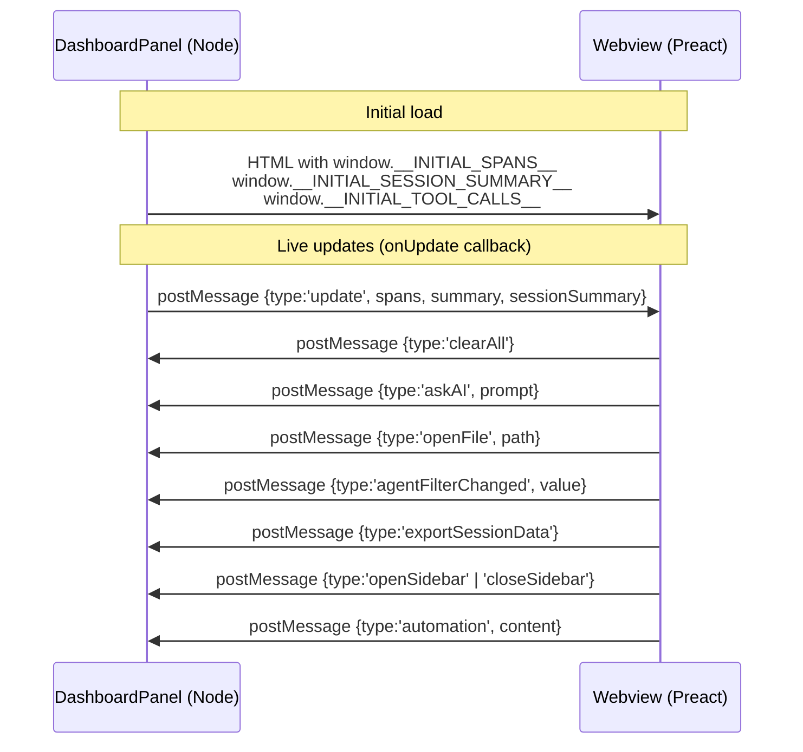

---

## 9. Cost Calculation

Cost is calculated entirely in the browser using a local pricing table. No network calls are made for pricing.

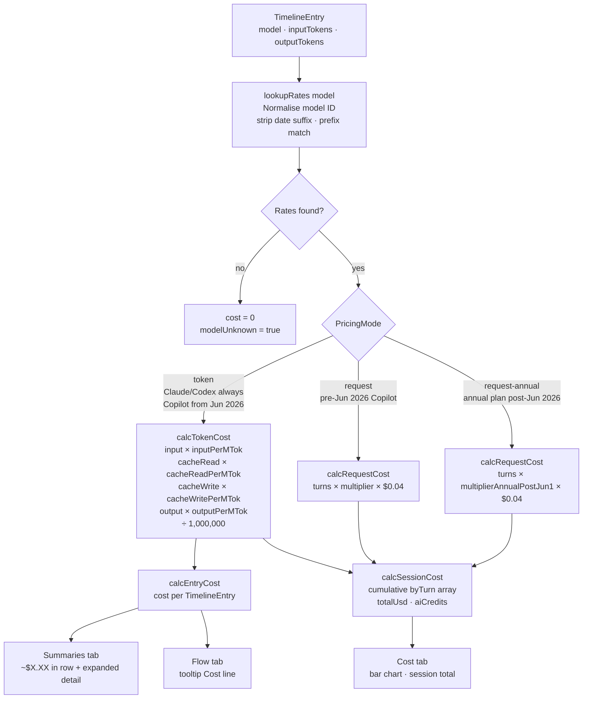

Pricing data (`media/src/pricing.ts`) covers: OpenAI (GPT-4.1 through GPT-5.5), Anthropic (Claude Haiku/Sonnet/Opus 4.x), Google (Gemini), Codex, and fine-tuned models. Last updated 2026-05-28.

---

## 10. Auto-Configuration

When the extension activates it attempts to configure each agent automatically. The methods differ because each agent reads its config differently.

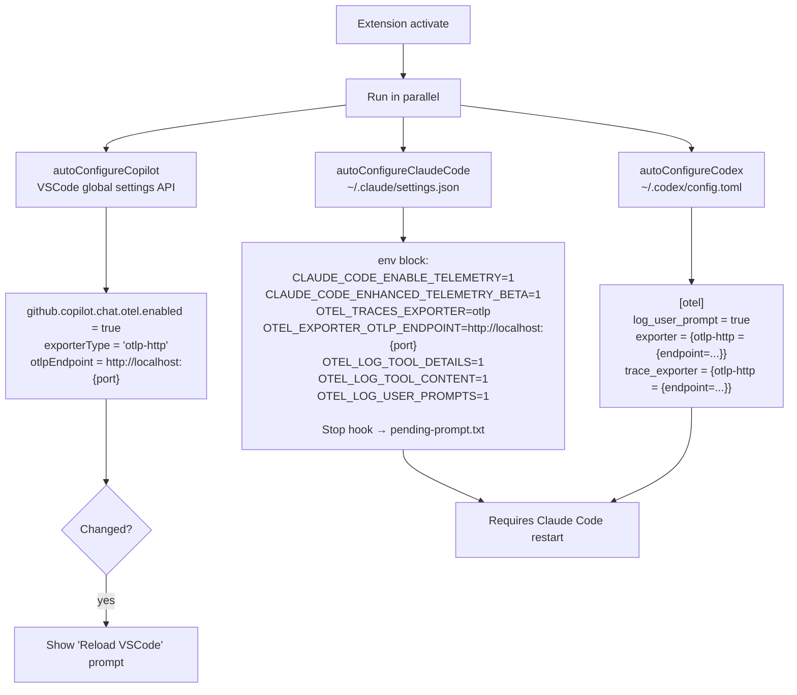

---

## 11. Build Pipeline

Four independent esbuild targets produce four output bundles.

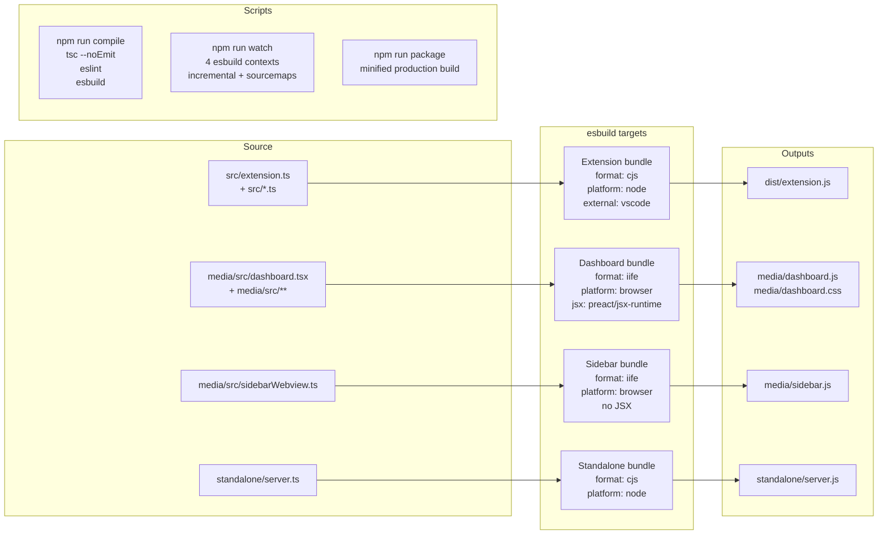

### Type-check vs bundle

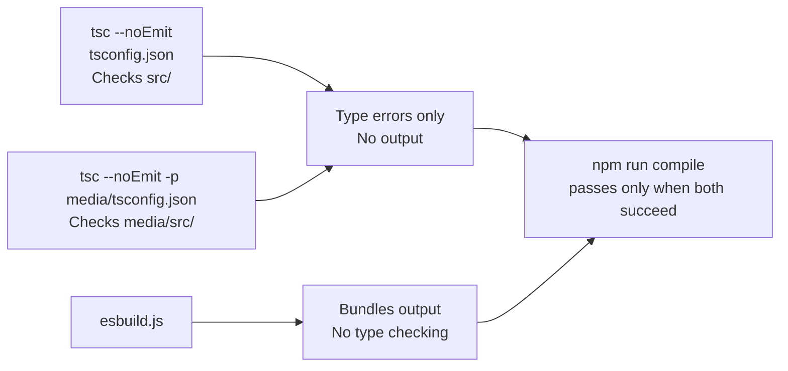

---

## File Map

```
agentlens/
├── src/
│   ├── extension.ts          # Activation, commands, panels, status bar
│   ├── otlpCollector.ts      # HTTP server, Codex session synthesis
│   ├── otlpParser.ts         # Pure parsing (tests/standalone)
│   ├── sessionStore.ts       # Span storage, persistence, callbacks
│   ├── spanSummarizer.ts     # Orchestrates per-agent builders
│   ├── sidebarPanel.ts       # Sidebar webview
│   ├── dashboardPanel.ts     # Full dashboard webview
│   ├── autoConfig.ts         # Copilot VSCode settings
│   ├── autoConfigNode.ts     # Claude/Codex file-based config
│   ├── exportData.ts         # JSON export helpers
│   └── summarizers/
│       ├── claude.ts         # Claude Code session builder
│       ├── copilot.ts        # Copilot session builder
│       ├── codex.ts          # Codex session builder
│       ├── helpers.ts        # Shared attribute/token extraction
│       └── summarizerTypes.ts# Shared TypeScript interfaces
├── media/
│   ├── src/
│   │   ├── App.tsx           # Preact root
│   │   ├── dashboard.tsx     # Tab container + routing
│   │   ├── state.ts          # All signals + computed values
│   │   ├── types.ts          # Frontend type definitions
│   │   ├── pricing.ts        # Model rate table
│   │   ├── sessionMetrics.ts # Cost + efficiency calculations
│   │   ├── utils.ts          # Formatting, span helpers
│   │   ├── agentProfiles.ts  # Per-agent thresholds
│   │   ├── sidebarWebview.ts # Sidebar JS (no JSX)
│   │   └── tabs/
│   │       ├── Cost.tsx      Tokens.tsx  Efficiency.tsx
│   │       ├── Summaries.tsx Traces.tsx  Flow.tsx
│   │       ├── Agents.tsx    Tools.tsx   Files.tsx
│   │       ├── Latency.tsx   Errors.tsx  Alerts.tsx
│   │       ├── Recommendations.tsx       Timeline.tsx
│   │       └── Automation.tsx Export.tsx Help.tsx
│   ├── dashboard.js          # Compiled Preact bundle
│   ├── dashboard.css         # Compiled styles
│   └── sidebar.js            # Compiled sidebar script
├── standalone/
│   └── server.ts             # Standalone HTTP server (no VSCode)
├── esbuild.js                # Build configuration
├── package.json              # VSCode manifest + scripts
└── ARCHITECTURE.md           # This file
```
