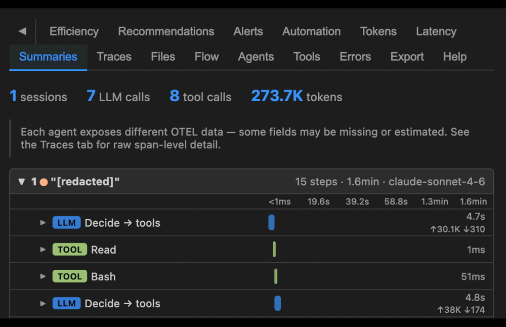

<h1> AgentLens</h1>

[](https://github.com/RogerReed/agentlens/actions/workflows/ci.yml)
[](LICENSE)



**Local** observability that makes AI agent sessions more transparent — see what's happening inside each run. Available as a VS Code extension or standalone Docker image, with no data leaving your machine. AgentLens captures OpenTelemetry traces from your agents and surfaces context growth, tool usage, token consumption, latency, errors, and file changes in real time — then helps you prompt your agents on inefficiencies to improve interactions.

## Getting Started

### VS Code Extension

1. **[Install from the VS Code Marketplace](https://marketplace.visualstudio.com/items?itemName=agentlens.agentlens-dashboard)**
2. Open the **AgentLens** view from the Activity Bar
3. AgentLens automatically configures Copilot, Claude Code, and Codex on first activation — restart any running agent sessions to pick up the new settings
4. Start an agent session and watch the dashboard populate in real time

### Standalone (Docker)

#### Running AgentLens

```bash
# Ephemeral — data cleared on container stop
docker run -p 127.0.0.1:3000:3000 -p 127.0.0.1:4318:4318 agentlens/agentlens

# Persistent — spans survive restarts (macOS/Linux)
docker run -p 127.0.0.1:3000:3000 -p 127.0.0.1:4318:4318 \
  -v ~/.agentlens:/data \
  agentlens/agentlens

# Persistent — spans survive restarts (Windows)
docker run -p 127.0.0.1:3000:3000 -p 127.0.0.1:4318:4318 `
  -v "$env:USERPROFILE\.agentlens:/data" `
  agentlens/agentlens
```

Open <http://localhost:3000> after the container starts.

#### Configuring Agents

Use the included setup scripts to configure agents automatically, or see [Manual Configuration](#manual-configuration) for the manual steps.

```bash
# macOS / Linux — make executable (once), then run
chmod +x scripts/configure-agents.sh
./scripts/configure-agents.sh
```

```powershell
# Windows (PowerShell) — if scripts are blocked, allow them first (once):
Set-ExecutionPolicy -ExecutionPolicy RemoteSigned -Scope CurrentUser
.\scripts\configure-agents.ps1
```

## Features

- **Telemetry Collection** — Built-in OpenTelemetry receiver captures traces and logs from Copilot, Claude Code, and Codex — no external infrastructure needed
- **Session Dashboard** — See inside every agent run: context growth, tool calls, token usage, latency, errors, and file changes across interactive real-time panels
- **Cost Estimation** — Estimates session cost for Copilot (three billing models) and Codex, with a per-session bar chart and cross-session cost table
- **Recommendations & Inefficiency Detection** — Surfaces context bloat, redundant tool calls, cache misses, and five loop/malfunction patterns — with suggested prompts to correct course
- **Configurable Alerts** — Threshold-based notifications for turns, errors, active time, and repeat tool calls — per-agent or shared

## Cost Estimation

The **Cost** tab estimates the dollar cost of Copilot and Codex sessions. Three Copilot billing models are supported via a toggle:

| Mode | Who it applies to |
| ---- | ----------------- |
| **Token-based AI Credits** (default) | All Copilot plans from Jun 1, 2026 — charges per input/output/cache token at per-model rates |
| **Request-based** | All plans before Jun 1, 2026 — multiplier × $0.04 per user-initiated prompt |
| **Annual plan request-based** | Annual-plan holders staying on request billing after Jun 1, 2026 — same formula, significantly higher multipliers |

The tab shows a per-session cost bar chart and a cross-session cost table that respects the active session filter. Included models (GPT-4.1, GPT-5 mini) show $0 under token-based billing, consistent with Copilot's pricing docs. Codex uses token-based pricing.

All figures are estimates — not your actual bill. Rates are sourced from GitHub's public pricing docs; see [PRICING_SOURCES.md](PRICING_SOURCES.md) for the authoritative URL for each billing model and notes for maintainers on keeping rates current.

Known gaps are listed at the bottom of the Cost tab, including long-context surcharges (not applied) and the session turn count proxy used for request-based billing.

## Recommendations & Malfunction Detection

The **Recommendations** tab analyzes session data and surfaces two categories of signal:

**Efficiency insights** — problems you can fix by adjusting your prompts:

- Context bloat (input tokens growing rapidly across turns)
- Files read multiple times, duplicate searches, large tool results
- Tool failures, high turn count, oversized starting context
- Low cache hit rate, tool definition overhead

**Loop & malfunction signals** — patterns indicating the agent is stuck or spiraling. These appear first in the list with a ↺ icon:

| Signal | Description | Trigger |
| ------ | ----------- | ------- |
| **Tool Call Deadlock** | Same tool + arguments called 3+ times (critical at 5+) | Agent not retaining tool results |
| **State Corruption Spiral** | A file edited then reverted to a prior state | Agent oscillating between conflicting constraints |
| **Hallucination Amplification Loop** | Same error recurring 3+ times | Fix attempts not resolving the root cause |
| **Ambiguous Success / Escalating Scope** | Too many steps for the task complexity | No clear completion condition |
| **Infinite Loop — Context Accumulation** | Input tokens growing while output ratio collapses 70%+ | Agent stuck, accumulating context without progress |

Each signal includes a specific recommended action and a **Copy for {Agent}** button that copies the recommendation prompt to your clipboard so you can paste it into your AI session. Use the **Ignore** button to dismiss signals that represent intentional behavior.

## Manual Configuration

The VS Code extension configures agents automatically on first activation. For standalone mode, run the included setup scripts (see [Configuring Agents](#configuring-agents) above). For detailed per-agent configuration steps, open the **Help** tab in the AgentLens dashboard.

## Replaying Exported Spans

The **Export** tab writes span files to your workspace root — `export_*.json` for full data or `export_redacted_*.json` with prompt text, tool inputs, and tool results replaced with `[redacted]`. Replay either to re-examine a past session without the original agent running:

```bash
pnpm run demo -- --file ./export_redacted_claude_main_20260522_152343.json
```

Spans are sent to port `4318` — the VS Code extension or standalone server must be running. Pass `--speed N` to pace the replay proportionally to the original session timing.

## Standalone Mode Options

AgentLens runs as a standalone web server outside VS Code — useful for CI, remote machines, or when you prefer a browser tab.

### Docker

Quick-start commands are in [Getting Started](#standalone-docker). Additional options:

**LAN-accessible** — exposes the dashboard to other devices on your network:

```bash
docker run -p 3000:3000 -p 4318:4318 -v ~/.agentlens:/data agentlens/agentlens
```

**Custom ports** — if `4318` is already in use by the VS Code extension:

```bash
docker run -p 127.0.0.1:3001:3000 -p 127.0.0.1:4319:4318 \
  -v ~/.agentlens:/data \
  agentlens/agentlens
```

Then point your agents at `http://localhost:4319` and open <http://localhost:3001>.

### Node.js (from source)

Requires Node.js 18+ and this repository cloned.

```bash
pnpm install
pnpm run standalone
```

Starts the OTLP receiver on port `4318` and the dashboard at <http://localhost:3000>. The standalone server uses the same port as the VS Code extension — only one can run at a time. To run both simultaneously:

```bash
OTLP_PORT=4319 UI_PORT=3001 pnpm run standalone
```

Spans are saved to `~/.agentlens/spans.json` and reloaded on restart. Set `DATA_DIR` to override the location.

## Automation Prompts File

When an automation threshold is crossed, AgentLens can write the generated prompt to a markdown file. To act on it automatically, configure your agent to watch or include that file as an input — for example, by pointing Claude Code at it via a hook or referencing it in a system prompt. Without that wiring, the file serves as a persistent, reviewable log you can paste from manually. For simpler workflows, leave **Write prompts file** off and use the **Copy Prompt** notification button instead.

### How it works

When **Write prompts file** is enabled for an automation rule, each trigger appends a timestamped entry to an agent-specific file:

| Agent | File written |
| --- | --- |
| Claude Code | `agentlens-prompts-claude.md` |
| GitHub Copilot | `agentlens-prompts-copilot.md` |
| Codex | `agentlens-prompts-codex.md` |

In the VS Code extension, files are written to the workspace root. In standalone mode, files are written to the directory where the server is running.

Each entry uses this format:

```markdown
## 2026-05-21 14:30:22 — Loop Breaker

[AgentLens Automation: Loop Breaker]

...generated prompt...

---
```

When **Write prompts file** is off (default), triggering an automation shows a notification with a **Copy Prompt** button instead — click it to copy the prompt to your clipboard, then paste into your agent.

## Commands

Open the VS Code Command Palette (`Cmd+Shift+P` / `Ctrl+Shift+P`) and search for **AgentLens**:

| Command | Description |
| ------- | ----------- |
| `AgentLens: Open Dashboard` | Open the full 16-tab dashboard in an editor panel |
| `AgentLens: Clear Session Data` | Wipe all collected spans from memory |
| `AgentLens: Export OTEL Data` | Write raw OTEL spans to JSON files in your workspace root (also available in the **Export** dashboard tab) |
| `AgentLens: Export OTEL Data (Redacted)` | Same, with prompt text, tool inputs, tool results, and PII replaced with `[redacted]` (also available in the **Export** tab) |

## Extension Settings

This extension contributes the following settings:

- `agentLens.otlpPort`: Local port for the OTLP trace receiver (default: `4318`)

## Agent Telemetry Formats

Each AI coding agent emits a different OTEL shape. AgentLens normalizes all three into a shared session model for the dashboard, while keeping raw telemetry available in the Traces tab.

### Copilot OTEL Format

**Format:** OpenTelemetry trace spans with a clean single-trace hierarchy. Each conversation is one trace; LLM calls and tool calls are child spans nested under a session root. No extra configuration needed.

**What's included:** Prompt text, token counts (input, output, cache read), model name, time-to-first-token, tool names, tool arguments, tool results, and file paths are all present natively without any extra configuration.

**Gaps:** Cache write token counts are not exposed — Copilot manages cache creation server-side and does not include it in telemetry. Cache read tokens (`gen_ai.usage.cache_read.input_tokens`) are available. No additional configuration unlocks further data — what Copilot exposes is already fully available.

---

### Claude Code OTEL Format

**Format:** OpenTelemetry trace spans. The session root span closes when the interaction ends, with LLM calls and tool calls as children. Optional supplemental log records are emitted when enhanced telemetry env vars are set.

**What's included:** With the recommended configuration (all three `OTEL_LOG_*` vars set): prompt text, token counts, model, tool names, tool arguments, file paths, and full file diff content are all available.

**Gaps:** The three `OTEL_LOG_*` env vars are not enabled by default — without them, tool arguments are absent, prompt text is omitted, and file diff content is unavailable. Cache token data is only present when using a model that supports prompt caching.

---

### Codex OTEL Format

**Format:** Primarily flat OTLP log records (structured JSON events sent to `/v1/logs`), not trace spans. Each session is a stream of log events grouped by conversation and turn identifiers. Adding `trace_exporter` to config also emits timing spans to `/v1/traces`.

**What's included:** With the recommended configuration (`log_user_prompt = true` and both exporters set): prompt text, token counts, model name, time-to-first-token, tool names, tool arguments, tool results, and span timing are all present.

**Gaps:** The Traces tab has less span granularity than Copilot or Claude Code since Codex is primarily log-based. Without `trace_exporter`, span waterfall data is limited.

---

> **Note:** Agent observability is evolving rapidly. All three platforms are actively expanding what they expose via OpenTelemetry, and the GenAI semantic conventions are still being standardized. AgentLens will be updated as richer telemetry becomes available.

## Additional Features

- **Files Changed** — The Files tab tracks every file created or modified by the agent, organized by session with inline before/after diffs
- **Multi-session Comparison** — The Agents tab shows side-by-side token totals, cache rates, TTFT, and top tools for Copilot, Claude, and Codex, plus a full cross-session history table
- **Automated Prompts** — The Automation tab lets you configure threshold-based automations (Loop Breaker, Turn Limit Wrap-up, Context Dump) that trigger a correction prompt when a session crosses a limit — delivered as a VS Code notification or written to a file for agent consumption

## AI Usage Disclosure

AgentLens was built primarily with [Claude Opus](https://www.anthropic.com/claude). Thank you to Anthropic for building tools that make projects like this possible.

## License

MIT

## Disclaimer

AgentLens is an independent open-source project and is not affiliated with, endorsed by, or associated with GitHub, Inc. or Microsoft Corporation (GitHub Copilot); Anthropic, PBC (Claude / Claude Code); or OpenAI, LLC (Codex CLI). All product names, trademarks, and registered trademarks are the property of their respective owners. AgentLens interacts with these products solely through their publicly documented OpenTelemetry telemetry interfaces.
